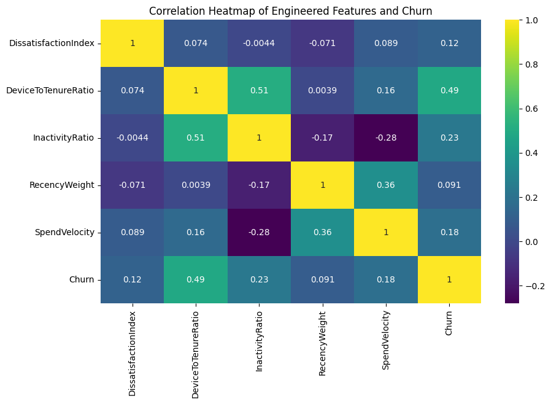
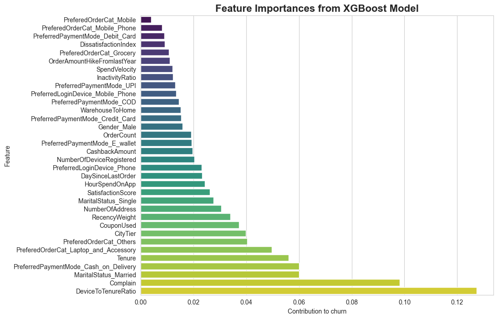

# End-to-End MLOps Pipeline: E-Commerce Customer Churn Prediction


**Purpose**: Demonstration of a full ML pipeline for customer churn prediction in e-commerce from data preprocessing through model training to a mock API deployment.  

---

## Scope & Intent  

- This repo is a **proof-of-concept / learning project**, not a production-ready system for live deployment.  
- The goal is to illustrate all major steps of a modern ML workflow:  
  - data cleaning & preprocessing  
  - feature engineering based on domain intuition  
  - handling class imbalance and imbalanced-class modeling  
  - model comparison and selection  
  - wrapping model + preprocessing into an API (using FastAPI)  
  - containerizing the stack for reproducibility (via Docker)  

Though all components are implemented end-to-end, the project serves primarily as a **sandbox / portfolio project** suitable to demonstrate skills, design sense, and ML pipeline awareness.

---

## What’s in the Repo  

- Data preprocessing + feature engineering notebooks
    - Engineered Features Correlation Heatmap
    
- Implementation of three modeling approaches (Logistic Regression, Random Forest, XGBoost)  
- Imbalanced data handling (SMOTE / class weights / stratified split)  
- A toy API (FastAPI) setup
- Docker setup for environment reproducibility  

---

Three model families were evaluated:

- Logistic Regression  
- Random Forest  
- **XGBoost (Winner)**  

All models were trained in an **imblearn Pipeline** including:

- `StandardScaler`  
- `SMOTE`  
- Classifier  

### Why XGBoost Won

It delivered the best balance of:

- **Recall on the churn class (95.3%)**
- **F1-score (0.93)**
- Stable performance across folds  
- Handles non-linear interactions extremely well  

| Model                | F1-Score | Recall (Churn) | Precision |
|----------------------|:--------:|:--------------:|:---------:|
| **XGBoost**          | **0.93** | **0.953**       | 0.900     |
| Random Forest        | 0.90     | 0.910          | 0.896     |
| Logistic Regression  | 0.62     | 0.842          | 0.489     |

### XGBoost Feature Importance



---

## How to Run (Local Demo Mode)
### API Demo (/predict)


```bash
docker build -t churn-api .
docker run -p 8000:8000 churn-api
```
The API becomes available at:
http://localhost:8000/docs
interactive Swagger UI where you can manually submit parameters

I’m currently building a portfolio website where this model will be integrated and exposed via a clean UI for real-time testing.

